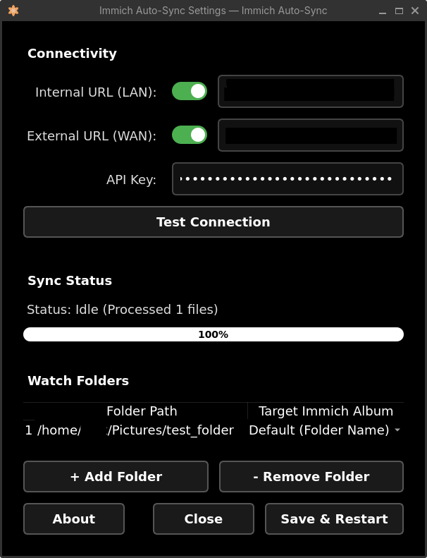
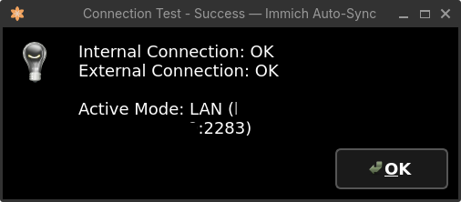

# Immich Auto-Sync for Linux

<div align="center">


</div>

A daemon-based synchronization tool for uploading media files from a Linux desktop to an [Immich](https://immich.app/) server.

This application monitors local directories (e.g., `~/Pictures`, `~/Videos`) for new files and automatically uploads them to your Immich instance. It runs as a background service and integrates with the desktop environment.

> [!WARNING]
> **This project is currently under active development and in the ALPHA phase.**
> Features may frequently change, bugs are to be expected, and data loss or sync issues are possible. Please use with caution and report any issues!

**Status:** Alpha. Supports Immich v1.118+.

## Screenshots

| Settings Window | System Tray Menu |
| :---: | :---: |
|  |  |
| **Ping Test Dialog** | **About Dialog** |
|  |  |

## Features

- **File Monitoring**: Uses `inotify` to detect new files.
- **Concurrent Uploads**: Uses multiple threads (10 workers) to process uploads.
- **Offline Reliability**: Uploads that drop mid-flight or queue without a connection are serialized to a local cache. They safely wait out offline statuses (or a total computer reboot) and resume pushing via background workers seamlessly dynamically updating progress meters.
- **Connectivity**: Automatically switches between **Internal (LAN)** and **External (WAN)** URLs based on availability with Captive Portal verification logic. You can selectively disable/enable these endpoints through UI toggles.
- **Custom Album Mapping**: Select an existing remote Immich album, type a custom album name to create, or let the app automatically create albums based on the local folder name (e.g., `~/Pictures/Vacation 2024` -> Album "Vacation 2024").
- **One-Way Sync**: Uploads media without modifying local files.
- **Security**: Stores the API Key in the system keyring (libsecret/KWallet).
- **Desktop Integration**:
  - **System Tray Icon**: Access to settings and status.
  - **Wayland Support**: Tested on GNOME Wayland (requires AppIndicator support).

## Installation

### Method 1: AppImage (Recommended)

The easiest way to install Immich Sync is via the standalone AppImage, which includes all dependencies out-of-the-box.

1. Go to the [Releases page](https://github.com/nicx17/immich_sync_app/releases) and download the latest `Immich_Sync-x86_64.AppImage`.
2. Make it executable:

   ```bash
   chmod +x Immich_Sync-*.AppImage
   ```

3. Run it, or use the provided integration script to strictly install it to your Application Launcher menu:

   ```bash
   # Optional: Download and run the install script from the repo to set up the .desktop file and systemd auto-start
   ./install-appimage.sh /path/to/downloaded/Immich_Sync-x86_64.AppImage
   ```

### Method 2: Manual / From Source

If you prefer not to use the AppImage, you can run the app directly from source.

#### Prerequisites

- Python 3.10+
- `gobject-introspection` (for system tray support)
- `libnotify` (optional)

**Ubuntu/Debian:**

```bash
sudo apt install python3-pip python3-venv libgirepository1.0-dev libcairo2-dev gir1.2-gtk-3.0 gir1.2-appindicator3-0.1
```

**Fedora:**

```bash
sudo dnf install python3-pip python3-gobject gtk3 libappindicator-gtk3
```

**Arch Linux:**

```bash
sudo pacman -S python-pip python-gobject gtk3 libappindicator-gtk3
```

### Setup

1. **Clone the Repository:**

    ```bash
    git clone https://github.com/yourusername/immich-sync-app.git
    cd immich-sync-app
    ```

2. **Create a Virtual Environment:**

    ```bash
    python3 -m venv .venv
    source .venv/bin/activate
    ```

3. **Install Dependencies:**

    ```bash
    pip install -r requirements.txt
    ```

## Usage

### 1. Launch the Application

Run the main script to start the background daemon and the system tray icon.

```bash
source .venv/bin/activate
python src/main.py
```

### 2. Configuration

The first run will open the **Settings Window** (or right-click the tray icon and select "Settings").

1. **Internal URL**: LAN address (e.g., `http://192.168.1.50:2283`). This can be toggled on/off.
2. **External URL**: WAN/Public address (e.g., `https://photos.example.com`). This can be toggled on/off.
3. **API Key**: Generate in Immich Web UI (Account Settings > API Keys).
4. **Watch Paths**: Add local folders to sync.

### 3. Automatic Start (Systemd)

To start automatically on login:

1. Copy the service file:

    ```bash
    mkdir -p ~/.config/systemd/user/
    cp setup/immich-sync.service ~/.config/systemd/user/
    ```

2. Edit the service file (`~/.config/systemd/user/immich-sync.service`) to update the path to the python executable and script location.
3. Enable and start the service:

    ```bash
    systemctl --user enable --now immich-sync
    ```

## Documentation

For detailed guides, please refer to:

- [Architecture Overview](docs/ARCHITECTURE.md)
- [Configuration Guide](docs/CONFIGURATION.md)
- [Troubleshooting](docs/TROUBLESHOOTING.md)
- [Development Guide](docs/DEVELOPMENT.md)

## Contributing

Pull requests are welcome. Check `roadmap.md` for planned features.

## Acknowledgments

- Application icon illustration by [Round Icons](https://unsplash.com/@roundicons?utm_source=unsplash&utm_medium=referral&utm_content=creditCopyText) on [Unsplash](https://unsplash.com/illustrations/a-white-and-orange-flower-on-a-white-background-IkQ_WrJzZOM?utm_source=unsplash&utm_medium=referral&utm_content=creditCopyText).

## License

GPLv3 License
