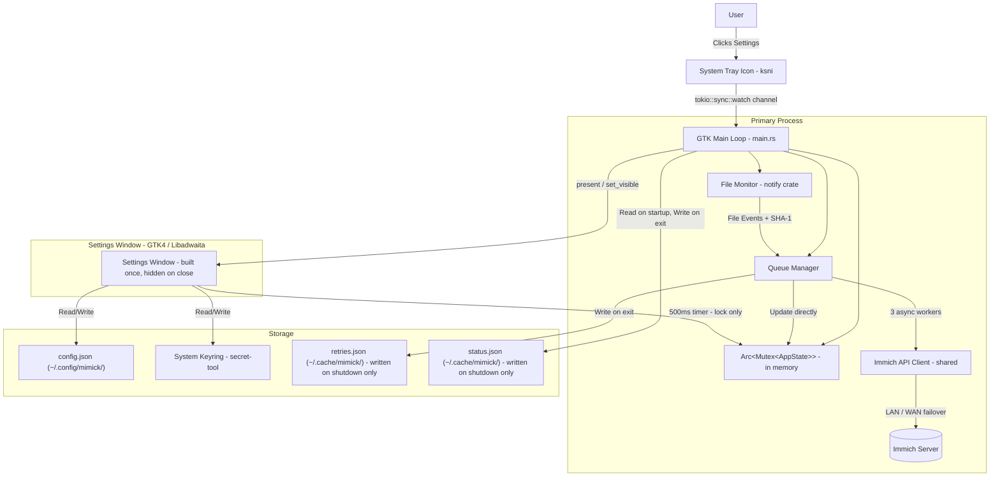

# Architecture Overview

This document describes the high-level architecture of `mimick`, a Linux desktop daemon for syncing media to Immich.

## System Components

The application is a **single-process** Rust daemon using the GTK4/Tokio runtime with application ID `io.github.nicx17.mimick`.

## Component Details

### 1. Core Daemon (`src/main.rs`)

Initializes the GTK4 `adw::Application` with ID `io.github.nicx17.mimick`. Only the primary instance (determined via D-Bus single-instance enforcement) spawns daemon services. Secondary processes forward their command line to the primary via GTK's single-instance mechanism.

- `connect_command_line` opens the settings window when `--settings` is passed **or** when `cmdline.is_remote()` is true (user clicks the app icon while the daemon is already running)
- Shared `Arc<Mutex<AppState>>` is created before all closures and threaded into both `connect_startup` (workers) and `connect_command_line` (settings window)
- Shared `Arc<ImmichApiClient>` is stored in a `OnceLock` and reused by the settings window — only one reqwest connection pool is ever allocated

### 2. File Monitor (`src/monitor.rs`)

Uses the `notify` crate for inotify-based filesystem events.

- Filters to media extensions only
- 2-second debounce per path
- Per-file `wait_for_file_completion` (async, Tokio task — no OS thread per file)
- SHA-1 checksum via 64KB chunked `spawn_blocking` (no load into RAM)

### 3. Queue Manager (`src/queue_manager.rs`)

Thread-safe upload orchestrator using a single `Arc<Mutex<AppState>>` for all counters and status.

- **3 async workers** sharing one `mpsc::Receiver` via `Arc<tokio::sync::Mutex>`
- Workers update `AppState` directly in memory — no disk writes during uploads
- **In-memory retry list** (`Arc<std::sync::Mutex<Vec<FileTask>>>`): retries on next successful upload (network recovery), flushed to disk only on graceful shutdown via `QueueManager::flush_retries()`
- Reads persisted retries from disk on startup (crash recovery); re-queues after 5s delay
- `QM_HANDLE: OnceLock<Arc<QueueManager>>` allows `main()` to call `flush_retries()` after `app.run()` returns

### 4. API Client (`src/api_client.rs`)

- LAN-first, WAN fallback connectivity check
- Active URL cached in `Mutex<Option<String>>`; cleared on network error to force re-check
- Files streamed with `reqwest::multipart::Part::stream_with_length` — zero RAM buffering
- Full 40-char SHA-1 hex used as `device_asset_id` for reliable Immich server-side deduplication
- Connection pool: max 1 idle connection per host, 30s idle timeout
- Single shared instance via `API_CLIENT_HANDLE: OnceLock<Arc<ImmichApiClient>>` — no new pool per settings window open

### 5. Settings UI (`src/settings_window.rs`)

- **Built once per process**, then hidden on close (`window.connect_close_request` → `set_visible(false)` + `Propagation::Stop`)  
- Subsequent opens call `win.present()` on the existing hidden window — zero new GTK allocations per open/close cycle
- `Arc<Mutex<AppState>>` passed in directly; the 500ms `glib::timeout_add_local` timer reads it without any disk I/O
- Album list fetched via the shared `Arc<ImmichApiClient>` on first show; a `glib::WeakRef` guard on the window ensures the async task returns early if the window is closed before the API responds
- Test Connection button uses the shared client — no new reqwest pool per click

### 6. System Tray (`src/tray_icon.rs`)

- Uses `ksni` (D-Bus StatusNotifierItem)
- Clicking "Settings" sends `true` on a `tokio::sync::watch` channel — **no child process spawned**
- A `glib::timeout_add_local(250ms)` in the GTK main loop polls an `Arc<Mutex<bool>>` flag set by the Tokio watch-forward task; on trigger, calls `open_settings_if_needed` in-process

### 7. State & Persistence

- **`AppState`**: in-memory struct shared by workers and UI via `Arc<Mutex<AppState>>`; `active_workers: usize` field (skipped in serde) tracks in-flight uploads for idle detection
- **`StateManager`** (`src/state_manager.rs`): reads saved state on startup for crash recovery; writes on graceful shutdown only
- **Retry queue**: in-memory during session; disk path `~/.cache/mimick/retries.json` written only on exit
- **Notifications**: `notify-send` via `std::process::Command::spawn()` + `child.wait()` (reaps child immediately, no zombies); called via `tokio::task::spawn_blocking` to avoid blocking the worker thread
